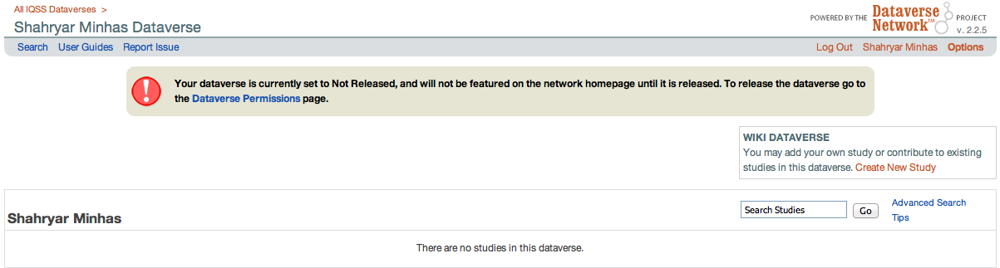

## Setting up your workspace

```{r, message=FALSE}
# Start with a clean workspace
rm(list=ls())

# Load libraries
library(foreign)
library(xtable)
library(apsrtable)
library(arm)
library(ggplot2)

# Functions that I use frequently
char = function(x){ as.character(x) }
num = function(x){ as.numeric(char(x)) }

# Relevant paths
# Mac
lab1Path='~/Dropbox/Duke/Spring 2015/PS 733/lab1'
lab1Path=file.path('~','Dropbox', 'Duke', 'Spring 2015', 'PS 733', 'lab1')
```

## Choosing a work to replicate

Pick a work to replicate strategically: 

* Published within the last five years
* Related to your research interests and that will help you progress in your
career
* Aim for one that has been done in at least a second tier journal like JPR or ISQ

## Presenting summary statistics for replication

When I took this class I replicated a paper by Salehyan, Gleditsch, and Cunningham that attempted to provide an explanation for why some rebel groups receive more assistance from foreign governments than others. Data for this paper can be downloaded from [here](http://privatewww.essex.ac.uk/~ksg/publ.html). 

```{r, results='hide'}
# Load data
sgcPath=paste0(lab1Path, '/sgc_io_data.txt')
sgc = read.table(sgcPath, sep="\t",header=T,na=".",quote="")

# Preview dataset

# Transforming ordinal rebel strength variable into binaries
unique(sgc$rs)
sgc$weak=0
sgc$weak[sgc$rs=='weak']=1
sgc$parity=0; sgc$parity[sgc$rs=='parity']=1
sgc$strong=0; sgc$strong[sgc$rs=='strong']=1
sgc$muchWeaker=0; sgc$muchWeaker[sgc$rs=='much weaker']=1

# descriptive statistics for variables of interest
vars=c( paste0('supp',1:3), # DVs
  'weak', 'parity', 'strong', 'muchWeaker',
  'cl', 'gs', 'tk', 'tc', 'noactors', 'riv' )

summary(sgc[,vars])

# summary may not provide the output you want
# I want following stats: N, mean, sd, min, max for each var
getStats=function(x){
  n=length(x[!is.na(x)])
  return( c( n, mu, sd, minMax ) )
}

# How would we efficiently **apply** this function
colnames(sgcStats)=c('N', 'Mean', 'Std. Dev.', 'Min', 'Max')

# To quickly print results to latex use xtable
xtable(sgcStats)
```

Below is a simple tabular display of the results.

$$\begin{tabular}{rrrrrr}
  \hline
 & N & Mean & Std. Dev. & Min & Max \\ 
  \hline
supp1 & 370.00 & 0.43 & 0.50 & 0.00 & 1.00 \\ 
  supp2 & 370.00 & 0.35 & 0.48 & 0.00 & 1.00 \\ 
  supp3 & 342.00 & 0.38 & 0.49 & 0.00 & 1.00 \\ 
  weak & 403.00 & 0.46 & 0.50 & 0.00 & 1.00 \\ 
  parity & 403.00 & 0.08 & 0.28 & 0.00 & 1.00 \\ 
  strong & 403.00 & 0.07 & 0.25 & 0.00 & 1.00 \\ 
  muchWeaker & 403.00 & 0.39 & 0.49 & 0.00 & 1.00 \\ 
  cl & 343.00 & 0.26 & 0.44 & 0.00 & 1.00 \\ 
  gs & 366.00 & 0.49 & 0.50 & 0.00 & 1.00 \\ 
  tk & 363.00 & 0.31 & 0.46 & 0.00 & 1.00 \\ 
  tc & 403.00 & 0.29 & 0.45 & 0.00 & 1.00 \\ 
  noactors & 403.00 & 2.52 & 2.54 & 1.00 & 13.00 \\ 
  riv & 403.00 & 0.52 & 0.50 & 0.00 & 1.00 \\ 
   \hline
\end{tabular}$$

Slightly nicer looking table.

$$\begin{tabular}{lccccc}
Variable & N & Mean & Std. Dev. & Min & Max \\ 
  \hline\hline
\multicolumn{6}{c}{\textit{Dependent Variables: Types of External Government Support}} \\
Alleged and Explicit Support  & 370 & 43\% & 50\% & 0 & 1 \\ 
Explicit Support & \multirow{2}{*}{370} & \multirow{2}{*}{35\%} & \multirow{2}{*}{48\%} & \multirow{2}{*}{0} & \multirow{2}{*}{1} \\ 
\; \; (Alleged set to 0) & & & & & \\
Explicit Support   & \multirow{2}{*}{342} & \multirow{2}{*}{38\%} & \multirow{2}{*}{49\%} & \multirow{2}{*}{0} & \multirow{2}{*}{1} \\ 
\; \; (Alleged set to missing) & & & & &  \\
\hline
\multicolumn{6}{c}{\textit{Independent Variables: Rebel Characteristics}} \\
Strong Central Command & 343 & 26\% & 44\% & 0 & 1 \\ 
Transnational Constituency & 363 & 31\% & 46\% & 0 & 1 \\ 
Territorial Control  & 403 & 29\% & 45\% & 0 &  1 \\ 
Rebels Much Weaker  & 401 & 39\% & 49\% &  0 & 1 \\ 
Rebels Weak or at Parity  & 401 & 54\% & 50\% & 0 & 1 \\ 
Rebels Strong  & 401 & 7\% & 25\% &  0 & 1 \\ 
  No. of Actors  & 403 & 2.52 & 2.54 &  1 & 13 \\ 
\hline
\multicolumn{6}{c}{\textit{Independent Variables: State
    Characteristics}} \\
Govt. Received Support  & 366 & 49\% & 50\%
& 0 & 1 \\ 
Rivalry  & 403 & 52\% & 50\% &  0 & 1 \\ 
\hline\hline
\end{tabular}$$

Can also use graphics (Mike prefers visualizations where possible).

```{r, fig.width=4, fig.height=3, fig.cap='supp1 barplot'}
supp1Cnt=table(sgc$supp1)
barplot(supp1Cnt, xlab='Alleged and Explicit Support', 
        names.arg=c('No Support', 'Support'))
```

```{r, fig.width=6, fig.height=3, fig.cap='barplot of DVs'}
# Plot efficiently
plotVars=c(vars[1:3], 'rs', vars[8:length(vars)])

par(mfrow=c(1,3))
dvTitles=c('Alleged and Explicit Support', 'Explicit Support (Alleged=0)', 
           'Explicit Support (Alleged=NA)')
# Set up loop to plot all three DVs
```

One more example...

```{r, fig.width=6, fig.height=3, fig.cap='histogram/density of no actors'}
par(mfrow=c(1,2))
hist(sgc$noactors, main='')
plot(density(sgc$noactors), main='')
```

## Proof that you set up your dataverse

<div style="text-align:center">

</div>

## Muller & Seligson Data

Download `Msrepl87.asc` from [Mike's dataverse](http://thedata.harvard.edu/dvn/dv/mward/faces/study/StudyPage.xhtml?globalId=hdl:1902.1/10185&studyListingIndex=1_b22ed98827d7d79d42ae0fe7fa97).

```{r, results='hide'}
# Load Data
msrepPath=paste0(lab1Path, "/Msrepl87.asc")
msrep = read.table(msrepPath, header=TRUE)

# Peak at data
msrep[1:3, ]
```

Some help with replicating figure 2

```{r, fig.width=6, fig.height=6, fig.cap='Muller and Seligson Figure 2'}
# Load Data
msrepPath=paste0(lab1Path, "/Msrepl87.asc")
msrep = read.table(msrepPath, header=TRUE)

# Peak at data
msrep[1:3, ]

# Var transformation as specified in M & S
# deaths variable
msrep$deaths75_2 <- (msrep$deaths75/msrep$pop75)
msrep$deaths75_2 <- msrep$deaths75_2 + 1
msrep$deaths75_2[msrep$deaths75_2 >= 50] <- 50
msrep$deaths75ln2 <- log(msrep$deaths75_2)

# Note that M & S drop two countries, read their paper and figure out which
# ones they drop

# standardizing measures for chart
msrep$deaths75ln2.std <- scale(msrep$deaths75ln2)
msrep$upper20.std <- scale(msrep$upper20)

# Plotting


```

Some help with replicating table 1.1

```{r}
# Read through the text carefully for other var transformations before
# running regression. 
# A few hints:
# M & S drop another country before moving to the regression
# Read footnote 9 in the paper and make necessary changes

# Running a linear regression

# View model results
```


## Visualizing regression results

Some consider it easier to quickly look at regression results by using coefficient plots rather than tables. 

## Simulations to construct an experiment

First we set up scenarios

```{r, fig.width=5, fig.height=4, fig.cap='Quick and dirty simulation'}
# Scenario 1: High intensity of separatism...other vars at central tendency
# Scenario 2: Low intensity of separatism...other vars at central tendency

```